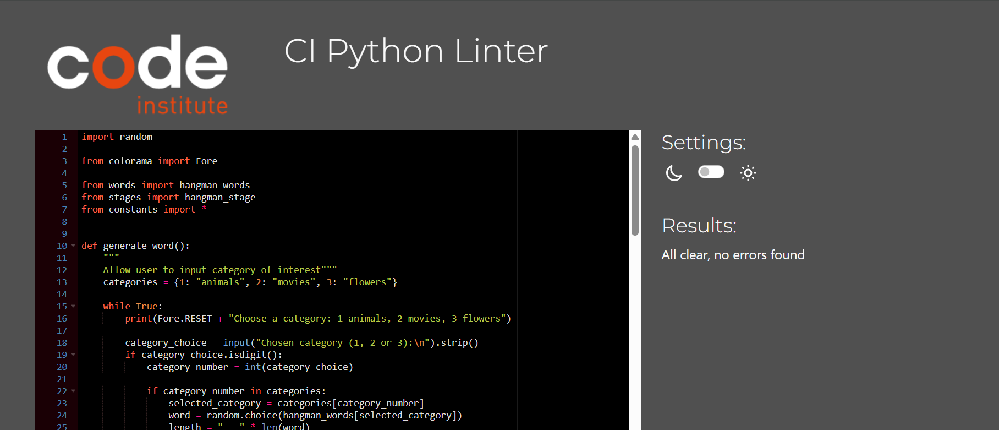

# Hangman - Mini game
  

  __The link to the [Hangman mini game](https://hangman-mini-game-365dbf261cd0.herokuapp.com/)__

  The hangman mini game is a Python terminal project, designed to:
  - Engage with the users by showing a word to be guessed.
  - Allow users to test their knowledge within three categories (types of animals, movies and types of flowers)

## How to play:
  1. Click this "[link](https://hangman-mini-game-365dbf261cd0.herokuapp.com/)"
  2. As soon as the page has loaded, click "RUN PROGRAM"
  3. Enter a number, from 1 - 3 to proceed. 
  - If you've selected 1, the instructions will appear, and then you will be asked to choose a category
  - If you've selected 2, you will skip over the instructions and be asked to choose a category
  - If you've selected 3, you will exit the game
  4. Enter a number from 1 - 3, 1 = animals, 2 = movies and 3 = flowers
  5. The hangman stage will appear, and a random word will be generated, with the number of letters shown on the screen
  6. Guess a single letter at a time:
  - For each incorrect guess, your hangman will build
  - For each correct guess, the blank "_" in the word will be replaced with the letter
  7. If all lives are used, you've lost the game! Alternatively, if you guess all letters
  correctly before your lives run out, you've won the game!
  8. After the game has been completed (win or lose), enter any key

## User Stories
### First Time Visiter Goals:
  __As a First Time Visitor...__
  - I want to be able to understand the programs primary purpose
  - I want to be able to navigate through the program easily 
  - I want to be able to interact with the programw ith ease
  - I want to see visual effects to stay engaged
### Frequent Visitor Goals:
  __As Frequent Visitor...__
  - I want to be able to guess different words

## Features
  - __When the program is loaded__

    The user sees a welcome message, alongside an overview of how to proceed, which engages them to start playing
      
      Shows the terminal menu with three options:
      1. Show the instructions
      2. Play the game
      3. Exit the game / quit

    

  - __When the user enters 1 to proceed - shows the instructions__

    The user will see the instructions for playing. Beneath the instructions, the user can proceed with playing the game.

    

  - __When the user enters a 2 or 3 to proceed - after instructions / play the game__

    The user will see three categories to choose from, 1 for animals, 2 for movies and 3 for flowers
    They can select which one they want to play.

    

  - __When the user chooses a category__

    Once the category has been chosen, the user will be shown the category chosen for playing, the number of letters in the word to be guessed and the hangman stage. They are asked to guess a single letter at a time.

    

  - __When the user enters a guess__

    The user is able to see an input for entering their guess, as well as seeing their previous guesses.

    For each incorrect guess, then hangman is built. For each correct guess, the letter is shown in the word.
      - Error messages shown if incorrect guess in red, or if the letter has been guessed before.
    
    
    - Correct guesses shown in green
    
    
## Flowchart
  The flowchart represents the logic of the program

  

## Technologies Used

### Languages: (DOUBLE CHECK)
- [Python 3.12.2](https://www.python.org/downloads/release/python-3122/): used to anchor the project and direct all application behavior

### Frameworks/Libraries, Programmes and Tools:
#### Python modules/packages:

##### Standard library imports:

- [random](https://docs.python.org/3/library/random.html) was used to implement pseudo-random number generation.

##### Third-party imports:
- [Colorama](https://pypi.org/project/colorama/) was used to add colors and styles to the project.

#### Other tools:
- [VSCode](https://code.visualstudio.com/) was used as the main tool to write and edit code.
- [Git](https://git-scm.com/) was used for the version control of the website.
- [GitHub](https://github.com/) was used to host the code of the website.
- [amiresponsive](https://codingll25.github.io/Formula-One-Memory-Card-Game/) was used to generate the responsive mockup

## Testing
### Manual testing
| feature | action | expected result | tested | passed | comments |
| --- | --- | --- | --- | --- | --- |
| Introduction message | Enter 1 | Instructions should appear above game area | Yes | Yes | - |
| Introduction message | Enter 2 | Game area should appear| Yes | Yes | - |
| Introduction message | Enter 3 | Exit game message should appear in red | Yes | Yes | - |
| Introduction message | Entering a letter or != 1/2/3| Error message should appear | Yes | Yes | - |
| Choosing category for playing | Enter 1/2/3 | Hangman stage built alongside word to be guessed| Yes | Yes | - |
| Choosing category for playing | Enter 1 | Confirmation that animals has been selected in blue | Yes | Yes | - |
| Choosing category for playing | Enter 2 | Confirmation that movies has been selected in blue | Yes | Yes | - |
| Choosing category for playing | Enter 3 | Confirmation that flowers has been selected in blue | Yes | Yes | - |
| Choosing category for playing | Enter 3 | Confirmation that flowers has been selected in blue | Yes | Yes | - |
| Choosing category for playing  | Entering a letter or != 1/2/3| Error message should appear | Yes | Yes | - |

### Validation
Code was passed through [CI Python Linter](https://pep8ci.herokuapp.com/#) with no errors.

## Deployment (double check this section)
### To deploy the project to Heroku so it can be run as a remote web application: 
- Clone the repository:
  1. Open a folder on your computer with the terminal.
    Run the following command
  - `git clone https://github.com/CodingLL25/hangman-mini-game.git .`

  Create your own GitHub repository to host the code, in this instance, "hangman-mini-game"

  2. Push the files to your repository with the following command:
  `git push`
    - Create a Heroku account if you don't already have one here [Heroku](https://dashboard.heroku.com).
    - Create a new Heroku application on the following page here [New Heroku App](https://dashboard.heroku.com/apps):

  3. Go to the Settings tab:

    - Click "Add buildpack":
    
    Add the Python and Node.js buildpacks in the following order:

      - ![Add Python and Node.js]

    - Click "Reveal Config Vars.":
        Add 1 new Config Vars:
        - Key: PORT Value: 8000
        - *This Config was provided by [CODE INSTITUTE](https://codeinstitute.net/)*.

      - ![Reveal Config Vars]

  4. Link your GitHub account and connect the application to the repository you created.

      - ![Link GitHub account]

    Click "Deploy Branch":

      - ![Deploy Branch]

      - Wait for the completion of the deployment.

      - ![Deploying Branch]

    5. Click "Open app" to launch the application inside a web page.

## Future Improvements
- Addition of username to increase engagement with the siter user, incorporate username into the print statements i.e. "See you next time User1234"
- Addition of more categories for users to pick from i.e. football players, countries, clothing brands to increase to engage with more users
- Remind the user of category chosen i.e. "Movie to be guessed: _ _ _" or "Flower to be guessed: _ _ _"

## Credits

## Acknowledgements
  - [Iuliia Konovalova](https://github.com/IuliiaKonovalova) for being a wonderful mentor throughout this process.