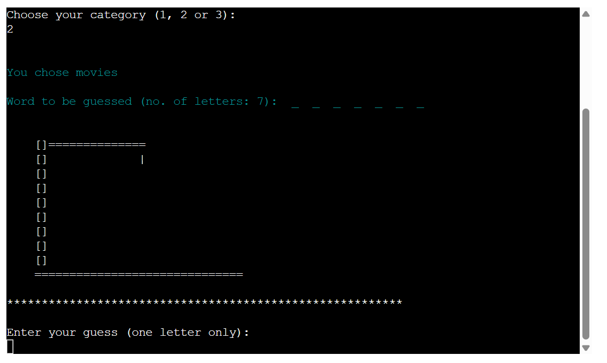

# Hangman - Mini game
  

  __The link to the [Hangman mini game](https://hangman-mini-game-365dbf261cd0.herokuapp.com/)__

  The hangman mini game is a Python terminal project, designed to:
  - Engage with the users by showing a word to be guessed.
  - Allow users to test their knowledge within three categories (types of animals, movies and types of flowers)

## How to play:
The overarching aim of this game is for the player (you) to guess all of the letters of a word, which has been chosen at random from your selected category. You must guess all the letters before your man has been hanged. Once the game has been won or loss, the player has the option to loop through more words within the category or choose a new category.

Overview provided below:
  1. Click this "[link](https://hangman-mini-game-365dbf261cd0.herokuapp.com/)".
  2. As soon as the page has loaded, click "RUN PROGRAM".
  3. Enter a number, from 1 - 3 to proceed. 
  - If you've entered 1, the instructions will appear, and then you will be asked to choose a category.
  - If you've entered 2, you will skip over the instructions and be asked to choose a category.
  - If you've entered 3, you will exit the game.
  4. Enter a number from 1 to 3, 1 for animals, 2 for movies and 3 for flowers.
  5. The hangman stage will appear, and a random word will be generated, with the number of letters shown on the screen
  6. Guess a single letter at a time:
  - For each incorrect guess, your hangman will build.
  - For each correct guess, the blank "_" in the word will be replaced with the letter.
  7. If all lives are used, you've lost the game! Alternatively, if you guess all letters.
  correctly before your lives run out, you've won the game!
  8. After the game has been completed (win or lose), enter any key to loop back to the welcome message.

## User Stories
### First Time Visiter Goals:
  __As a First Time Visitor...__
  - I want to be able to understand the programs primary purpose
  - I want to be able to navigate through the program easily 
  - I want to be able to interact with the program with ease
  - I want to see visual effects to stay engaged (i.e. use of colors)
  - I want to be kept up to date of my progress (correctly guessed letters, incorrect guesses)
### Frequent Visitor Goals:
  __As Frequent Visitor...__
  - I want to be able to guess different words

## Features
  - __When the program is loaded__

    The user sees a welcome message, alongside an overview of how to proceed, which engages them to start playing
      
      Shows the terminal menu with three options:
      1. Show the instructions
      2. Play the game
      3. Exit the game / quit

    

  - __When the user enters 1 to proceed - shows the instructions__

    The user will see the instructions for playing. Beneath the instructions, the user can proceed with playing the game.

    

  - __When the user enters a 2 or 3 to proceed - after instructions / play the game__

    The user will see three categories to choose from, 1 for animals, 2 for movies and 3 for flowers
    They can select which one they want to play.

    

  - __When the user chooses a category__

    Once the category has been chosen, the user will be shown the category chosen for playing, the number of letters in 
    the word to be guessed and the hangman stage. They are asked to guess a single letter at a time.

    

  - __When the user enters a guess__

    The user is able to see an input for entering their guess, as well as seeing their previous guesses.

    For each incorrect guess, then hangman is built, and error messages shown if incorrect guess in red, or if the 
    letter has been guessed before.
    
    

    For each correct guess, a message appears confirming the letter is in the word (shown in green) and the letter is 
    revealed in the word.
    
    
  

## Flowchart
  The flowchart represents the logic of the program

  

## Technologies Used

### Languages:
- [Python 3.12.2](https://www.python.org/downloads/release/python-3122/): used to anchor the project and direct all 
application behavior

### Frameworks/Libraries, Programmes and Tools:
#### Python modules/packages:

##### Standard library imports:

- [random](https://docs.python.org/3/library/random.html) was used to implement pseudo-random number generation.

##### Third-party imports:
- [Colorama](https://pypi.org/project/colorama/) was used to add colors and styles to the project.

#### Other tools:
- [VSCode](https://code.visualstudio.com/) was used as the main tool to write and edit code.
- [Git](https://git-scm.com/) was used for the version control of the website.
- [GitHub](https://github.com/) was used to host the code of the website.
- [amiresponsive](https://codingll25.github.io/Formula-One-Memory-Card-Game/) was used to generate the responsive mockup
- [heroku](https://dashboard.heroku.com/apps)for deploying a mock terminal for the program.
- [CI Linter](https://pep8ci.herokuapp.com/) for validating the code.
- [MS Snipping Tool](https://apps.microsoft.com/detail/9mz95kl8mr0l?hl=en-us&gl=US) for png images captured within the README file.

## Testing
## Bugs
### Solved bugs
- Movies within "words.py" are captialized, meaning the first letter of the word was not recognized within the code, resulting in the incorrect error messages appearing when the correct letter was entered. This was fixed by utilizing "word.lower()"
- Looping back to see the main function upon winning or losing the game was not working when "enter" was selected. 

### Manual testing (TO BE FINALISED)
| feature | action | expected result | tested | passed | comments |
| --- | --- | --- | --- | --- | --- |
| Introduction message | Enter 1 | Instructions should appear above game area | Yes | Yes | - |
| Introduction message | Enter 2 | Game area should appear| Yes | Yes | - |
| Introduction message | Enter 3 | Exit game message should appear in red | Yes | Yes | - |
| Introduction message | Entering a letter or != 1/2/3| Error message should appear | Yes | Yes | - |
| Choosing category for playing | Enter 1/2/3 | Hangman stage built alongside word to be guessed| Yes | Yes | - |
| Choosing category for playing | Enter 1 | Confirmation that animals has been selected in blue | Yes | Yes | - |
| Choosing category for playing | Enter 2 | Confirmation that movies has been selected in blue | Yes | Yes | - |
| Choosing category for playing | Enter 3 | Confirmation that flowers has been selected in blue | Yes | Yes | - |
| Choosing category for playing | Enter 3 | Confirmation that flowers has been selected in blue | Yes | Yes | - |
| Choosing category for playing  | Entering a letter or != 1/2/3| Error message should appear | Yes | Yes | - |

### Validation
Code was passed through [CI Python Linter](https://pep8ci.herokuapp.com/#) with no errors.

## Deployment
The Code Institute provided a [P3 template](https://github.com/Code-Institute-Org/p3-template) in Git Hub, which 
enabled deployment of the project to a mock terminal in Heroku. To do this, I followed the instructions provided for 
the Love Sandwiches Essential Project Walkthrough.

  1. Create a new folder with the name of your program or game in VScode

  2. Create a new repository in GitHub using the P3 template provided by the Code Institute.

  3. Clone the repository and set up the project in VS code by running the following command in the terminal:
      - `git clone https://github.com/CodingLL25/hangman-mini-game.git .`

  4. Push the files to your repository with the following command:
  `git push`
      - Create a Heroku account if you don't already have one here [Heroku](https://dashboard.heroku.com).
      - Create a new Heroku application on the following page here [New Heroku App](https://dashboard.heroku.com/apps):

  5. Go to the Settings tab:

  - Click "Add buildpack":
    
    - Add the Python buildpack first, followed by Node.js: 

      

    - Click "Reveal Config Vars.":
        Add 1 new Config Vars:
        - Key: PORT Value: 8000
        - *This Config was provided by [CODE INSTITUTE](https://codeinstitute.net/)*.

      

  6. Link your GitHub account and connect the application to the repository you created.

  

  

  7. Click "view" to launch the application inside a web page.

  

## Future Improvements
- Addition of username to increase engagement with the siter user, incorporate username into the print statements. For example, "See you next time User1234".
- Addition of more categories for users to pick from i.e. football players, countries, clothing brands to increase to engage with more users.
- Remind the user of category chosen i.e. "Movie to be guessed: _ _ _" or "Flower to be guessed: _ _ _"
- Store previously guessed words to prevent repetition,; for players cycling through words, keep track of how many words have been guessed correctly and how many have been guessed incorrectly.
- Use of os clear with the play game function to improve usability by preventing the need to scroll.

## Credits

## Acknowledgements
  - [Iuliia Konovalova](https://github.com/IuliiaKonovalova) for being a wonderful mentor throughout this process, and for providing clear guidance for this submission.